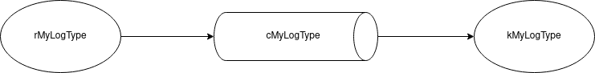

# Write a Flume Interceptor to modify events header on the fly

Apache Flume is an efficient and flexible tool for ingesting and processing
large amounts of data in a distributed environment.

Flume operates in a client-server architecture, where the agents on each
machine collect the data and transport it to a centralized Flume server,
which then writes the data to the configured data sinks. It supports a variety
of data sources, including log files, syslog, netcat, and more. Flume also
provides a rich set of plugins and extensions, which makes it highly
customizable and extensible.

Flume is especially suitable for moving large amounts of log data and other
streaming data from various sources to a centralized data store such as HDFS.

This article describes an issue where several Flume agent get stuck for no
apparent reason and stop writing data on HDFS.

I will show you how to investigate and identify the issue, and how to solve it
using Flume Interceptors.

## Flume topology description



rMyLogType is defined as an [Avro Source](https://flume.apache.org/releases/content/1.11.0/FlumeUserGuide.html#avro-source):

```INI
a1.sources.rMyLogType.type = avro
a1.sources.rMyLogType.bind = flume.mycompany.com
a1.sources.rMyLogType.port = 44444
a1.sources.rMyLogType.channels = cMyLogType
```

cMyLogType is a [File Channel](https://flume.apache.org/releases/content/1.11.0/FlumeUserGuide.html#file-channel).
This Flume channel send its events from the rMyLogType source to the
kMyLogType sink:

```INI
a1.channels.cMyLogType.type = file
```

Finally kMyLogType is an [HDFS Sink](https://flume.apache.org/releases/content/1.11.0/FlumeUserGuide.html#hdfs-sink).
This Flume sink uses the country header to set the directory path of the file
in which the events are written (see `%{country}` in the
`a1.sinks.kMyLogType.hdfs.path` property below):

```INI
a1.sinks.kMyLogType.channel = cMyLogType
a1.sinks.kMyLogType.type = hdfs
a1.sinks.kMyLogType.hdfs.path = hdfs://mycompany-cluster/user/mycompany/logs/flume/myLogType/%{country}/current
```

## Issue and investigation

***In the rest of this article, FLUME_HOME is set to the path to the Flume
home directory, e.g. `FLUME_HOME=/opt/flume`***

As stated in the preamble to this article, the issue is that several Flume
agents suddenly stop writing data on HDFS.

Luckily, Flume offers several metrics to monitor sources, channels and sinks.

Let's see what's going on:

```shell
# Replace <agent monitoring port> by the numerical monitoring port.
# The monitoring port of each Flume agent is defined in the configuration
# file at $FLUME_HOME/conf/flume-env.sh, e.g. AGENT_1_MONITORING_PORT=34545
curl -s http://flume.mycompany.com:<agent monitoring port>/metrics | jq -Mr '.["SOURCE.rMyLogType"]'
{
  "AppendBatchAcceptedCount": "5634890",
  "GenericProcessingFail": "0",
  "EventAcceptedCount": "28172690",
  "AppendReceivedCount": "0",
  "StartTime": "1682500964003",
  "AppendBatchReceivedCount": "5634890",
  "ChannelWriteFail": "0",
  "EventReceivedCount": "28172690",
  "EventReadFail": "0",
  "Type": "SOURCE",
  "AppendAcceptedCount": "0",
  "OpenConnectionCount": "5",
  "StopTime": "0"
}

curl -s http://flume.mycompany.com:<agent monitoring port>/metrics | jq -Mr '.["CHANNEL.cMyLogType"]'
{
  "Unhealthy": "0",
  "ChannelSize": "20",
  "EventTakeAttemptCount": "31011495",
  "StartTime": "1682500959364",
  "Open": "true",
  "CheckpointWriteErrorCount": "0",
  "ChannelCapacity": "15000000",
  "ChannelFillPercentage": "4.5",
  "EventTakeErrorCount": "0",
  "Type": "CHANNEL",
  "EventTakeSuccessCount": "28172755",
  "Closed": "0",
  "CheckpointBackupWriteErrorCount": "0",
  "EventPutAttemptCount": "28172760",
  "EventPutSuccessCount": "28172760",
  "EventPutErrorCount": "0",
  "StopTime": "0"
}

curl -s http://flume.mycompany.com:<agent monitoring port>/metrics | jq -Mr '.["SINK.kMyLogType"]'
{
  "ConnectionCreatedCount": "32109",
  "BatchCompleteCount": "1192",
  "EventWriteFail": "0",
  "BatchEmptyCount": "1310151",
  "EventDrainAttemptCount": "28172830",
  "StartTime": "1682500961896",
  "BatchUnderflowCount": "1528596",
  "ChannelReadFail": "0",
  "ConnectionFailedCount": "0",
  "ConnectionClosedCount": "32073",
  "Type": "SINK",
  "EventDrainSuccessCount": "28172830",
  "StopTime": "0"
}
```

The cMyLogType ChannelFillPercentage is suspiciously high, and a more thorough
look at it shows that indeed the cMyLogType File Channel fill percentage keeps
growing, and therefore the events are stuck in it.

```shell
curl -s http://flume.mycompany.com:<agent a1 monitoring port>/metrics | jq -Mr '.["CHANNEL.cMyLogType"] | .ChannelFillPercentage'
4.7
```

A look at the Flume agent logs discloses the final hint on what is going on:

```
Caused by: java.lang.IllegalArgumentException: Pathname /user/mycompany/logs/flume/myLogType/fr';WAITFOR DELAY '0:0:32'--/current/_MyLogType_20220707_14_flume01_a3.1657202736341.seq.tmp from hdfs://mycompany-cluster/user/mycompany/logs/flume/myLogType/fr';WAITFOR DELAY '0:0:32'--/current/_MyLogType_20220707_14_flume01_a3.1657202736341.seq.tmp is not a valid DFS filename.
```

The problem is that the country header, which should be a 2-character country
code, is defined using an unreliable external string field, and can sometimes
be set to an invalid value, e.g.:

```
fr'+(select*from(select(sleep(20)))a)+'
fr'.)(.,")).
fr'XJdBkx<'">tHndBx
fr'nvOpzp; AND 1=1 OR (<'">iKO)),
fr) AND 1884=1884-- ffjs
fr) AND 4904=4904 AND (5459=5459
fr) AND 6726=8402 AND (8335=8335
fr) AND 8263=3105-- WYZL
fr)) AND 1535=5731 AND ((3940=3940
fr)) AND 1884=1884-- XkBD
fr)) AND 4904=4904 AND ((3073=3073
fr)) AND 7007=7794-- lVlA
fr)) ORDER BY 1-- Hmpc
fr70236806' or 5536=5540--
friy3j4h234hjb23234
```

This is inconvenient, but still does not cause more trouble than creating
invalid directory names on HDFS.

However, the country header sometimes contains characters which are invalid
for an HDFS directory name, e.g. `fr';WAITFOR DELAY '0:0:32'--` in the above
exception. In that case, the Flume agent will raise an
IllegalArgumentException.

Even worse, the event will be stuck in the cMyLogType File Channel, and will
block all the following events!

As a consequence, the File Channel fill percentage will kept growing, as we
have experienced earlier.

## Solution: step-by-step guide

The chosen solution is to use [Flume Interceptors](https://flume.apache.org/releases/content/1.11.0/FlumeUserGuide.html#flume-interceptors)
to modify the country header on the fly.

### Implement the Interceptor class

The interceptor below will set the country header to the first two consecutive
alphabetic characters in the original country header and put it in lower case.

```java
/**
 * Licensed to the Apache Software Foundation (ASF) under one
 * or more contributor license agreements.  See the NOTICE file
 * distributed with this work for additional information
 * regarding copyright ownership.  The ASF licenses this file
 * to you under the Apache License, Version 2.0 (the
 * "License"); you may not use this file except in compliance
 * with the License.  You may obtain a copy of the License at
 *
 *     http://www.apache.org/licenses/LICENSE-2.0
 *
 * Unless required by applicable law or agreed to in writing, software
 * distributed under the License is distributed on an "AS IS" BASIS,
 * WITHOUT WARRANTIES OR CONDITIONS OF ANY KIND, either express or implied.
 * See the License for the specific language governing permissions and
 * limitations under the License.
 */

package com.mycompany.flume.interceptor;

import java.util.List;
import java.util.Map;

import org.apache.flume.Context;
import org.apache.flume.Event;
import org.apache.flume.interceptor.Interceptor;
import org.slf4j.Logger;
import org.slf4j.LoggerFactory;

/**
 * Interceptor class which modifies the country header (if it exists).
 *
 * It drops all except the first two consecutive alphabetic characters and converts them to lower case.
 * If the country header does not contain two consecutive alphabetic characters, it drops all characters
 * except the first two ones.
 *
 * Sample config:<p>
 *
 * <code>
 *   agent.sources.r1.channels = c1<p>
 *   agent.sources.r1.type = SEQ<p>
 *   agent.sources.r1.interceptors = i1<p>
 *   agent.sources.r1.interceptors.i1.type = com.mycompany.flume.interceptor.FixCountryHeaderInterceptor$Builder<p>
 * </code>
 *
 */
public class FixCountryHeaderInterceptor implements Interceptor {

  private static final Logger logger = LoggerFactory.getLogger(FixCountryHeaderInterceptor.class);

  private final String countryKey = "country";

  /**
   * Only {@link HostInterceptor.Builder} can build me
   */
  private FixCountryHeaderInterceptor() {
    // no-op
  }

  @Override
  public void initialize() {
    // no-op
  }

  /**
   * Modifies events in-place.
   */
  @Override
  public Event intercept(Event event) {
    Map<String, String> headers = event.getHeaders();

    if (headers.containsKey(countryKey)) {
      String origCountry = headers.get(countryKey);
      String fixedCountry = origCountry.replaceFirst("^[^A-Za-z]*([A-Za-z]{2}).*$", "$1")
        .replaceFirst("^(..).*$", "$1")
        .toLowerCase();
      if (!fixedCountry.equals(origCountry)) {
        headers.put(countryKey, fixedCountry);
        logger.info("Replaced " + countryKey + " header, from <" + origCountry + "> to <" + fixedCountry + ">");
      }
    }

    return event;
  }

  /**
   * Delegates to {@link #intercept(Event)} in a loop.
   * @param events
   * @return
   */
  @Override
  public List<Event> intercept(List<Event> events) {
    for (Event event : events) {
      intercept(event);
    }
    return events;
  }

  @Override
  public void close() {
    // no-op
  }

  /**
   * Builder which builds new instance of the FixCountryHeaderInterceptor.
   */
  public static class Builder implements Interceptor.Builder {

    @Override
    public void configure(Context context) {
      // no-op
    }

    @Override
    public Interceptor build() {
      logger.info("Creating FixCountryHeaderInterceptor");
      return new FixCountryHeaderInterceptor();
    }

  }

}
```

I now need to compile this class into a jar (let's call it
`flume-interceptors-1.0.0.jar`) and distribute it with flume at
`$FLUME_HOME/lib/flume-interceptors-1.0.0.jar`.

### Define the interceptor topology

The next step is to define a new topology (dubbed interceptor topology) which
makes use of this interceptor.


I only need to define the interceptor i1 in the Avro Source:

```INI
a1.sources.rMyLogType.type = avro
a1.sources.rMyLogType.bind = flume.mycompany.com
a1.sources.rMyLogType.port = 44444
a1.sources.rMyLogType.channels = cMyLogType
a1.sources.rMyLogType.interceptors = i1
a1.sources.rMyLogType.interceptors.i1.type = com.mycompany.flume.interceptor.FixCountryHeaderInterceptor$Builder

a1.channels.cMyLogType.type = file

a1.sinks.kMyLogType.channel = cMyLogType
a1.sinks.kMyLogType.type = hdfs
a1.sinks.kMyLogType.hdfs.path = hdfs://mycompany-cluster/user/mycompany/logs/flume/myLogType/%{country}/current
```

However, if this topology is deployed now, new events will have their header fixed
but the ones already stuck in the rMyLogType file channel won't be impacted.
This is because a Flume interceptor can only be applied on a Flume source, whereas
the events, because of the original topology, are stuck in the cMyLogType File Channel!

As a consequence, I need first to define a temporary topology to flush the
file channel (dubbed flushFileChannel topology) before using the interceptor
topology above.

### Define the flushFileChannel topology


```INI
a1.sources.rMyLogType.type = avro
a1.sources.rMyLogType.bind = flume.mycompany.com
a1.sources.rMyLogType.port = 44444
a1.sources.rMyLogType.channels = cMyLogType

a1.channels.cMyLogType.type = file

a1.sinks.kMyLogTypeAvro.channel = cMyLogType
a1.sinks.kMyLogTypeAvro.type = avro
a1.sinks.kMyLogTypeAvro.hostname = localhost
a1.sinks.kMyLogTypeAvro.port = 44445

a1.sources.rMyLogTypeAvro.type = avro
a1.sources.rMyLogTypeAvro.bind = localhost
a1.sources.rMyLogTypeAvro.port = 44445
a1.sources.rMyLogTypeAvro.channels = cMyLogTypeAvro
a1.sources.rMyLogTypeAvro.interceptors = i1
a1.sources.rMyLogTypeAvro.interceptors.i1.type = com.mycompany.flume.interceptor.FixCountryHeaderInterceptor$Builder

a1.channels.cMyLogTypeAvro.type = file

a1.sinks.kMyLogType.channel = cMyLogTypeAvro
a1.sinks.kMyLogType.type = hdfs
a1.sinks.kMyLogType.hdfs.path = hdfs://mycompany-cluster/user/mycompany/logs/flume/myLogType/%{country}/current

```

That way, I can:
- flush the events from the cMyLogType channel into the kMyLogTypeAvro avro
  sink.
- fix the country header (drop all characters except the first two consecutive
  alphabetic ones) in the rMyLogTypeAvro Avro Source using the above Flume
  interceptor.
- write the events with a now fixed country header in the kMyLogType HDFS
  Sink (by routing them through cMyLogTypeAvro File Channel).

### Flush the File Channel

Set the flushFileChannel topology described above in
`$FLUME_HOME/conf/flume-conf.properties`, restart the impacted Flume
agents, and wait for the cMyLogType File Channel fill percentage to decrease
down to 0%.

For example for agent a1 (wait until ChannelFillPercentage is close to 0):

```shell
watch -n 10 'curl -s http://flume.mycompany.com:<agent a1 monitoring port>/metrics | jq -Mr ".[\"CHANNEL.channel_Impression_storeInHdfs\"] | .ChannelFillPercentage"'
```

### Deploy the interceptor topology

Now that the cMyLogType File Channel is completely empty, I can stop Flume
and deploy the simpler interceptor topology above.

This will allow me to:
- fix the country header (drop all characters except the first two consecutive
  alphabetic ones) in the rMyLogType Avro Source using a custom Flume
  interceptor.
- write the events with fixed country header in kMyLogType HDFS
  Sink (by routing them through cMyLogType File Channel).

Set the interceptor topology described above in
`$FLUME_HOME/conf/flume-conf.properties` and restart all Flume
agents to load the interceptorTopology.

## A few final words

Flume Interceptors are a powerful tool to modify/drop events on the fly.

The documentation for writing a Flume Interceptor is quite sparse, but once
you got the knack of it it is quite simple.

After that, it is mainly a matter of plumbing (I mean topology!) to get what
you want!

## About the author

Christophe Préaud is data architect at Kelkoo Group.

You can connect with him on [LinkedIn](https://www.linkedin.com/in/christophe-pr%C3%A9aud-184023155).
