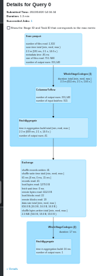

# Spark - good practices: some common caveats and solutions

## never collect a Dataset

Never collect - quoted from the scaladoc:

`(collect) should only be used if the resulting array is expected to be small, as all the data is loaded into the driver's memory`

```scala
ds.collect()  // NOT OK - is long and has a good change
              // of crashing the driver, unless ds is small

ds.show()     // OK - displays only the first 20 rows of ds

ds.write.parquet(...)  // OK - saves the content of ds out into external storage
```

## evaluate as little as possible

From the Spark ScalaDoc:

`Operations available on Datasets are divided into transformations and actions. Transformations are the ones that produce new Datasets, and actions are the ones that trigger computation and return results
(...)
Datasets are "lazy", i.e. computations are only triggered when an action is invoked`

In other words, you should limit the number of actions you apply on your Dataset, since each action will trigger a costly computation, while all transformations are lazily evaluated.

Though it is not alway possible, the ideal would be to call an action on your Dataset only once. Nevertheless, avoid calling an action on your Dataset unless it is necessary.

For example, doing a count (which is an action) for log printing should be avoided.

`dsOut` is computed twice in the exemple below:
```scala
case class Data(id: Long, desc: String, price: Double)
val ds = Seq(
  Data(1, "a", 123), Data(2, "b", 234), Data(3, "c", 345),
  Data(4, "a", 234), Data(5, "a", 345), Data(6, "b", 123),
  Data(7, "a", 234), Data(8, "c", 345), Data(9, "a", 234),
  Data(10, "b", 234)).toDS

val dsOut = ds.map({ line =>
   line.copy(desc = s"this is a '${line.desc}'")
})
println(s"num elements: ${dsOut.count}")  // first dsOut computation
dsOut.show                                // second dsOut computation
```
The simplest and preferable solution would be to skip the print, but if it is absolutely necessary you can use accumulators instead:
```scala
val accum = sc.longAccumulator("num elements in ds")
val dsOut = ds.map({ line =>
   accum.add(1)
   line.copy(desc = s"this is a '${line.desc}'")
})

dsOut.show  // single dsOut computation
println(s"num elements: ${accum.value}")
```

## use built-in functions rather than UDF

## manage wisely the number of partitions

## deactivate unnecessary cache

## always specify schema when reading file (parquet, json or csv) into a DataFrame

Let's begin with a Dataset mapped on case class `TestData`:
```scala
case class TestData(id: Long, desc: String)
import spark.implicits._
import org.apache.spark.sql.SaveMode
val ds = Seq(
  TestData(1L, "a"), TestData(2L, "b"), TestData(3L, "c"),
  TestData(4L, "d"), TestData(5L, "e")).toDS
ds.show
// will output:
// +---+----+
// | id|desc|
// +---+----+
// |  1|   a|
// |  2|   b|
// |  3|   c|
// |  4|   d|
// |  5|   e|
// +---+----+

// save ds locally
val localFile = "file:///home/cpreaud/output/test_schema_change"
ds.repartition(1).write.mode(SaveMode.Overwrite).parquet(localFile)
```
Now let's add a new field `comment` in case class `TestData`
```scala
case class TestData(id: Long, desc: String, comment: String)
```
We hit an error when we try to map the parquet file loaded as a Dataset to the new definition of `TestData`, because the schema of the parquet file and the schema of `TestData` do not match anymore:
```scala
val dsRead = spark.read.parquet(localFile).as[TestData]
// will output:
// org.apache.spark.sql.AnalysisException: cannot resolve 'comment' given input columns: [desc, id]
//  at org.apache.spark.sql.catalyst.analysis.package$AnalysisErrorAt.failAnalysis(package.scala:54)
// (...)
```
It works correctly if the schema is enforced when the parquet file is read:
```scala
import org.apache.spark.sql.Encoders
val schema = Encoders.product[TestData].schema
val dsRead = spark.read.schema(schema).parquet(localFile).as[TestData]
dsRead.show
// will output:
// +---+----+-------+
// | id|desc|comment|
// +---+----+-------+
// |  1|   a|   null|
// |  2|   b|   null|
// |  3|   c|   null|
// |  4|   d|   null|
// |  5|   e|   null|
// +---+----+-------+
```

## avoid union performance penalties when reading parquet files

Doing a `union` to produce a single Dataset from several parquet files loaded as Datasets takes a lot more time than loading all the parquet files at once into a single Dataset.

Load each parquet file into a Dataset and union all these Datasets to produce a single Dataset:
```scala
import org.apache.hadoop.fs.{FileSystem, Path}
import org.apache.spark.sql.Encoders
import SaleRecord

val fs = FileSystem.get(sc.hadoopConfiguration)
val saleSchema = Encoders.product[SaleRecord].schema

fs.globStatus(new Path("/path/to/sale/data/*/2022/202203/202203*"))
    .map(_.getPath.toString)
    .foldLeft(spark.emptyDataset[SaleRecord])((acc, path) =>
    acc.union(spark.read.schema(saleSchema).parquet(path).as[SaleRecord])
).count
```
&rarr; Took 12 min

Let's have a look at the Spark UI for more understanding on what's going on.
- the DAG for the union of Datasets is huge (the image below display only a small part of the DAG):
<div></div>
- analyzing this complex DAG takes time: there is a big pause at the start of the application - CHP:

<div></div>

Now load all parquet files at once into a single Dataset:
```scala
import org.apache.hadoop.fs.{FileSystem, Path}
import org.apache.spark.sql.Encoders
import SaleRecord

val fs = FileSystem.get(sc.hadoopConfiguration)
val saleSchema = Encoders.product[SaleRecord].schema

val listSales = fs
  .globStatus(new Path("/path/to/sale/data/*/2022/202203/202203*"))
  .map(_.getPath.toString)
spark.read
  .schema(saleSchema)
  .parquet(listSales:_*)
  .as[SaleRecord]
  .count
```
&rarr; Took 2.1 min

The Spark UI confirms that things are better now.
- the DAG is very simple:
<div></div>
- there is no pause at the start of the application:
<div></div>

## prefer select over withColumn

## remove extra columns when mapping a Dataset to a case class with fewer columns

When a Dataset[T] is mapped to Dataset[U] (`Dataset[T].as[U]`), with U being a subclass of T with fewer columns, the resulting Dataset will still contain the extra columns.

Let's illustrate this with an example:
```scala
case class Data(f1: String, f2: String, f3: String, f4: String)

case class ShortData(f1: String, f2: String, f3: String)

val ds = Seq(
  Data("a", "b", "c", "d"), Data("e", "f", "g", "h"),
  Data("i", "j", "k", "l")).toDS

ds.as[ShortData].show
// will output:
// +---+---+---+---+
// | f1| f2| f3| f4|
// +---+---+---+---+
// |  a|  b|  c|  d|
// |  e|  f|  g|  h|
// |  i|  j|  k|  l|
// +---+---+---+---+
```

We would have expected only columns `f1`, `f2` and `f3`, but in fact, even the schema still contain the extra column `f4`!
```scala
ds.as[ShortData].printSchema
// will output:
// root
//  |-- f1: string (nullable = true)
//  |-- f2: string (nullable = true)
//  |-- f3: string (nullable = true)
//  |-- f4: string (nullable = true)
```
This is due to `Dataset[T].as[U]` being lazy. Adding a transformation (even a transformation doing nothing!) will fix the issue:
```scala
ds.as[ShortData].map(identity).show
// will output:
// +---+---+---+
// | f1| f2| f3|
// +---+---+---+
// |  a|  b|  c|
// |  e|  f|  g|
// |  i|  j|  k|
// +---+---+---+

ds.as[ShortData].map(identity).printSchema
// will output:
// root
//  |-- f1: string (nullable = true)
//  |-- f2: string (nullable = true)
//  |-- f3: string (nullable = true)
```

## (Scala) Prefer immutable variables
