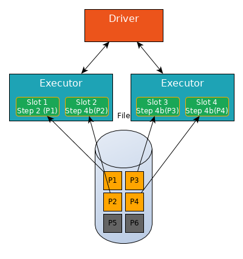

# Spark: Jobs and Stages

## Glossary

- Transformation: lazy evaluated Dataset operation which returns a Dataset (see ***Typed transformations*** and ***Untyped transformations*** in the [Spark Dataset scaladoc](http://spark.apache.org/docs/latest/api/scala/index.html#org.apache.spark.sql.Dataset))
  - Narrow transformation: The data required to compute the records in a single Partition resides in at most one Partition of the parent Dataset (no shuffle)
  - Wide transformation: The data required to compute the records in a single Partition may reside in many Partitions of the parent Dataset (i.e. it triggers a shuffle operation, see below)
- Action: Dataset operation which returns a result to the driver (i.e. is evaluated and triggers the evaluation of previous transformations on the Dataset)
- Task: a unit of work that will be sent to one executor and done by a single thread
- Slot: the number of Tasks that can be processed simultaneously by the Spark application. The total number of Slots is ***number of executors × number of cores*** reserved for the Spark application
- Job: several transformation(s) followed by (exactly) one action
- Stage: several narrow transformations followed by (exactly) one wide transformation
- Shuffle: a shuffle operation is triggered when data needs to be moved between executors:
  - data is written from RAM to local disk on the source executor
  - the data is sent to another executor (the driver decides which executor gets which piece of data)
  - the data is copied back into RAM on the destination executor

## Example: Write Job

| Step | Method  | Operation             |
| :--: | :----:  | :-------------------: |
| 1    | Read    | Narrow transformation |
| 2    | Filter  | Narrow transformation |
| 3    | Map     | Narrow transformation |
| 4    | GroupBy | Wide transformation   |
| 5    | Filter  | Narrow transformation |
| 6    | Map     | Narrow transformation |
| 7    | Write   | Action                |

Step 4 is a stage boundary: a new stage is created to process all remaining Steps (5, 6, 7).

The synchronization between Tasks is done with a shuffle operation (i.e. data is moved between executors).

Hence, the Write job will be broken down into two stages:

### Stage 1

| Step    | Method        |
| :--:    | :-----------: |
| 1       | Read          |
| 2       | Filter        |
| 3       | Map           |
| 4a      | GroupBy 1/2   |
| 4b      | shuffle write |

Step 4 is a stage boundary: all the Tasks must synchronize (i.e. all partitions must complete **Stage 1** before continuing to **Stage 2**).

### Stage 2

| Step    | Method       |
| :--:    | :----------: |
| 4c      | shuffle read |
| 4d      | GroupBy 2/2  |
| 5       | Filter       |
| 6       | Map          |
| 7       | Write        |

In more details:

Four slots have been reserved for the Spark application. The file to read is split into 6 partitions (P1 to P6).

In **Stage 1**, Spark will create a pipeline of transformations in which the data is read into RAM (Step 1), and then perform Steps 2, 3, 4a and 4b on each partition.

All four slots read a partition of the data into RAM (Step 1)

Some partitions are quicker to process than others, a slot can performs next steps in **Stage 1** for this partition without waiting for other partitions.

Step 4 is a stage boundary, all slots at this step (Slot 2, 3 and 4) must write shuffle data for this partition (Step 4b).

Then process another partition (Slot 2 and 3 now process partitions P5 and P6, Slot 4 is still writing shuffle data for P4).

Notice that Slot 1 and Slot 4 are not working, they cannot be assigned a new Task as long as **Stage 1** is not finished.

When partitions P1 to P6 have finished Step 4b (i.e. they have finished writing their shuffle files), **Stage 1** is finished and **Stage 2** begins.

In **Stage 2**, Spark will create a pipeline of transformations in which the shuffle files are read into RAM (Step 4c), and then perform Steps 4d, 5, 6 and 7 on each partition.

All four slots read shuffle files into RAM (Step 4c).

And so on...

## Building a house (the job) analogy

- The first stage would be to lay the foundation.
- The second stage would be to erect the walls.
- The third stage would be to add the room.

Then each stage can be broken down into several operations, e.g. for the first stage:

- digs trenches
- pours concrete

Each operation in each stage is handled by tasks which can be done independently (i.e. you can start pouring the concrete in one trench even if other trenches are still being dug).

However, you have to wait for all first stage tasks to be finished before starting to erect the walls.
